<!--
    {
        "name":"Create a Heatwave instance",
        "description":"Create a Heatwave instance in the private subnet"
    }
-->

Provision a Heatwave instance. 

1. Click the **Navigation menu** in the upper left, navigate to **Databases**, and under **HeatWave**, select **DB Systems**.
    
    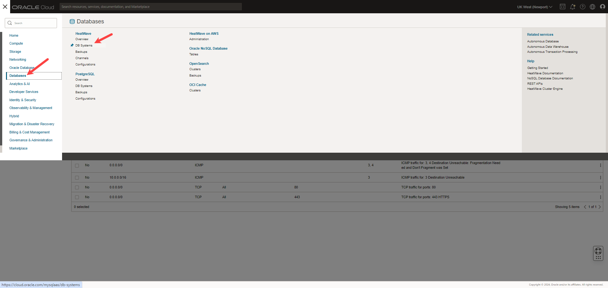

2. Ensure that **[](var:hw_compartment_name)** compartment is selected, and click **Create DB system**.

    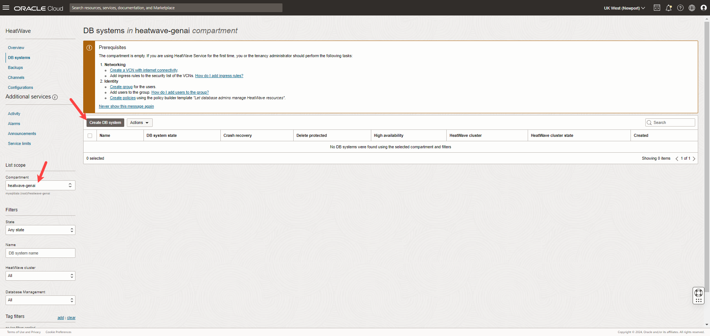

3. In the **Create DB system** panel, select **Development or Testing**.

4. Under **Create in compartment**, ensure **[](var:hw_compartment_name)** is selected, and enter a name for the DB system, e.g. [](var:hw_dbs_name).

  **Name**:

    ```
    <copy> [](var:hw_dbs_name)</copy>
    ```

5. Enter the administrator credentials. *Note* the administrator credentials as you will need them to connect to the DB system. 

    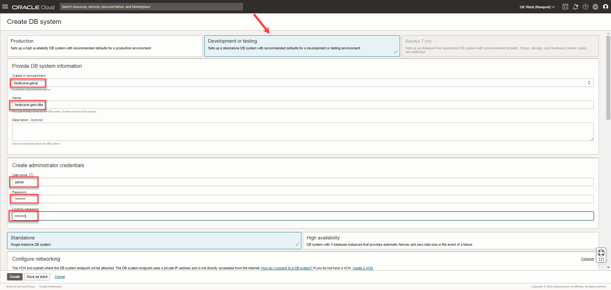

6. Select **Standalone** instance, and select the VCN, **[](var:hw_vcn_name)**, and private subnet, **private subnet-[](hw_vcn_name)**, which you created earlier.

   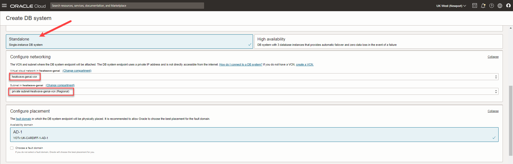

7. Let the **Configure placement** settings remain as is.

8. Under **Configure hardware**, select **Enable HeatWave cluster**, and click **Change shape**.

   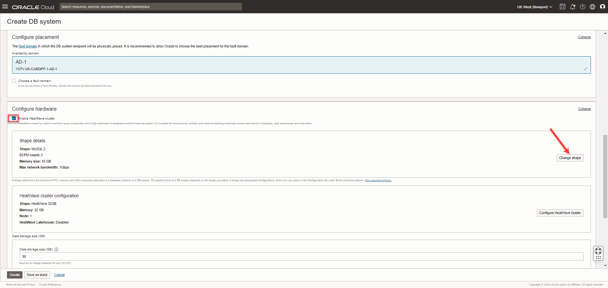

9. In the **Browse all shapes** page, ensure the compute model is **ECPU**, select **MySQL.32** shape, and click **Select a shape**. The ECPU Shape of the DB system must be MySQL.32.

    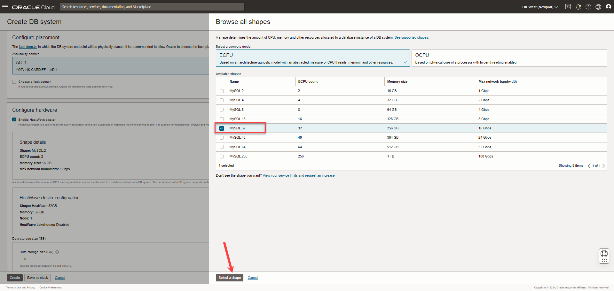

10. Click **Configure HeatWave cluster**.

    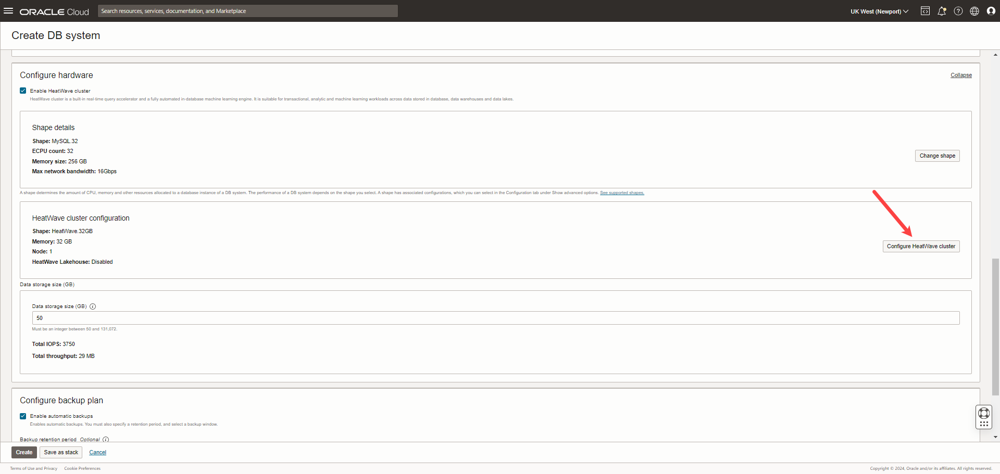

11. In **Configure HeatWave cluster** page, click **Change shape**.

    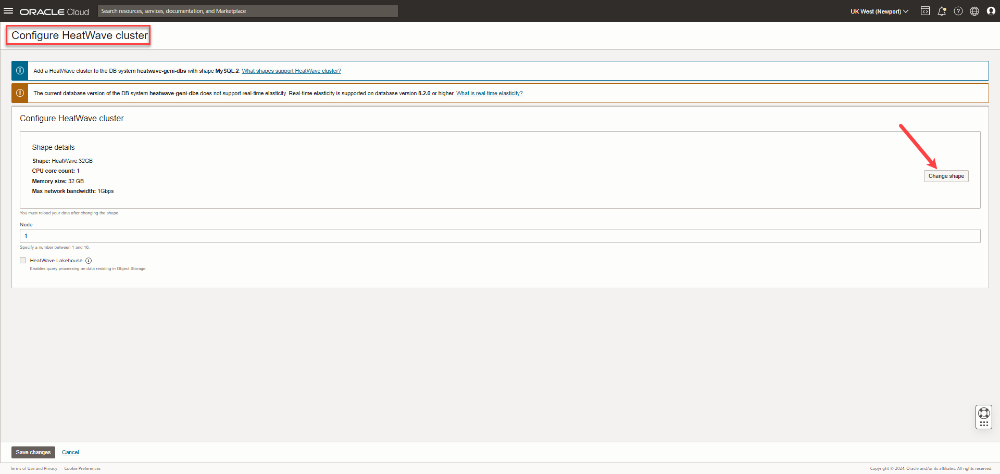

12. In the **Browse all shapes** page, select **HeatWave.512** shape, and click **Select a shape**. The HeatWave Shape must be HeatWave.512.

    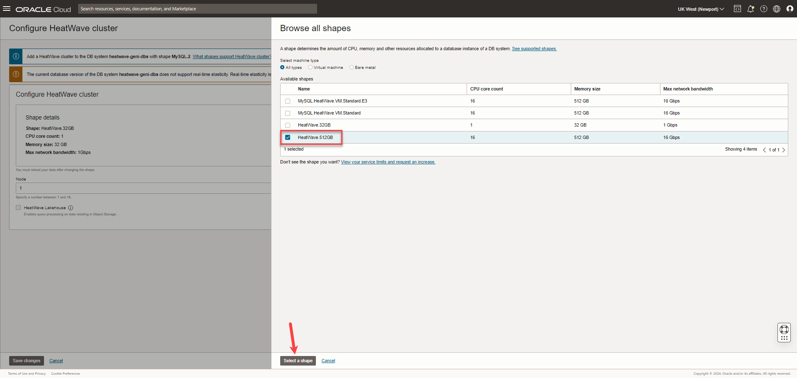

13. Select **HeatWave Lakehouse**, and click **Save changes**. HeatWave Lakehouse must be enabled on the DB system.

    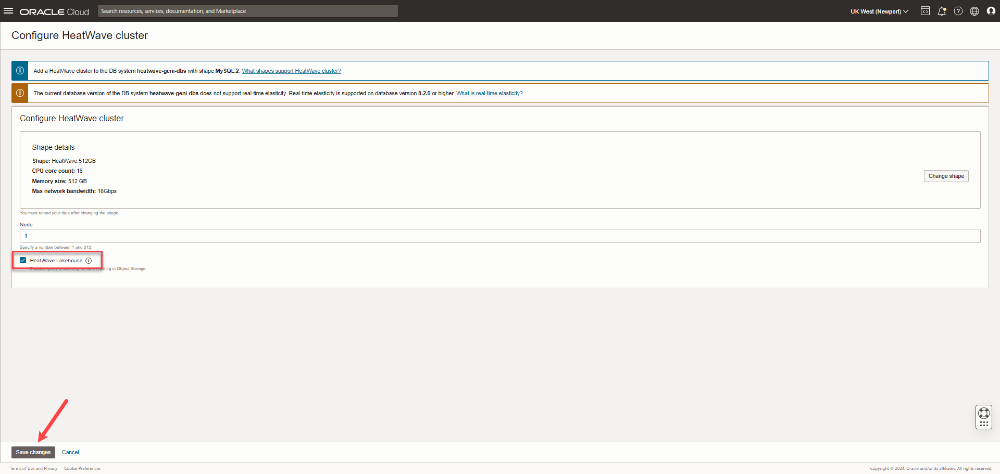

14. Click **Show advanced options**.

15. Go to the **Configuration** tab, and under **Database version**, select version **[](hw_db_version)** or higher version.

    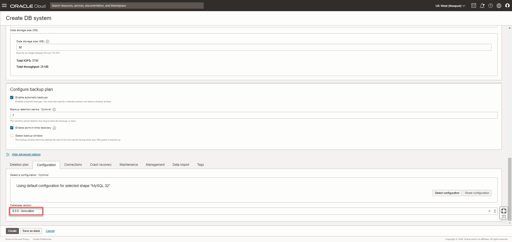

16. Go to the **Connections** tab, enter the **Hostname**, which is same as DB system name e.g. [](hw_db_name), and click **Create**:

    **Hostname**:

    ```
    <copy>heatwave-genai-dbs</copy>
    ```

    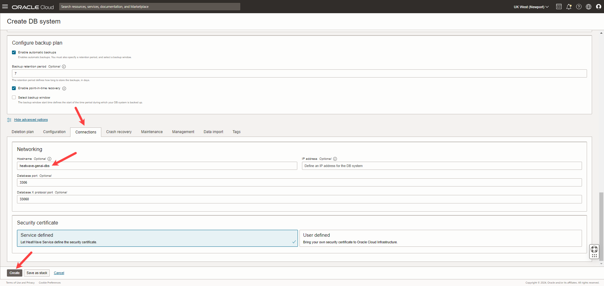

17.  While the DB system is created, the state is shown as **CREATING**.

    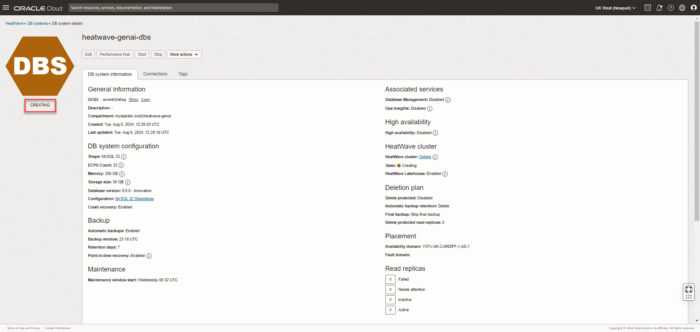

18. The new DB system will be ready to use after a few minutes. The state **ACTIVE** indicates that the DB system is ready for use. 

    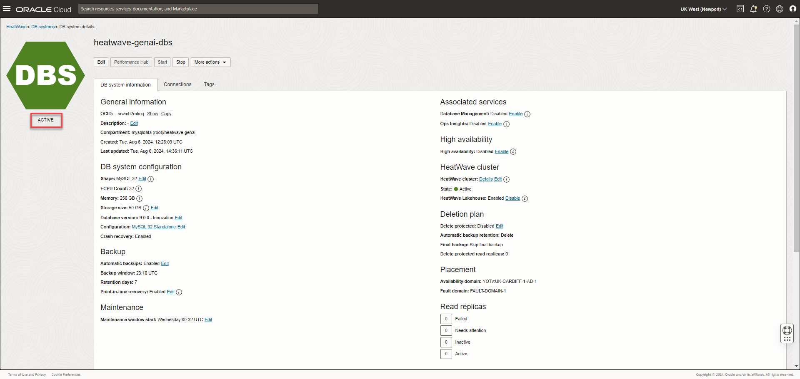

19. In the **Connections** tab, note the **Private IP address** of the DB system, which is the HeatWave endpoint.

    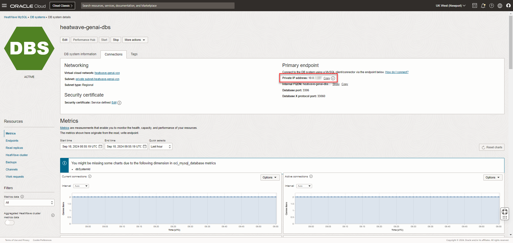