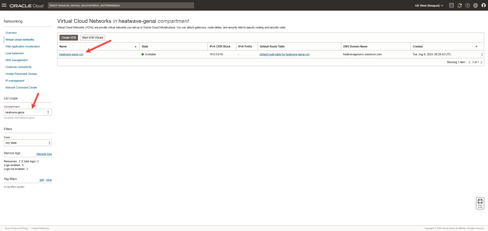
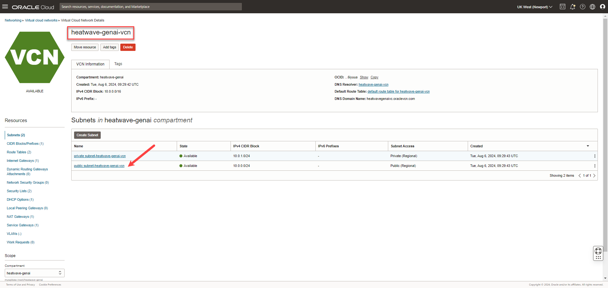
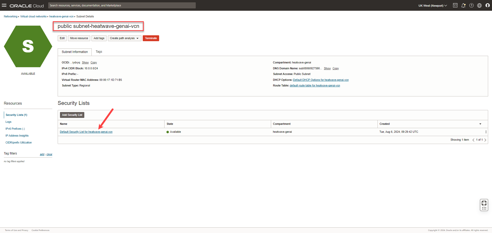
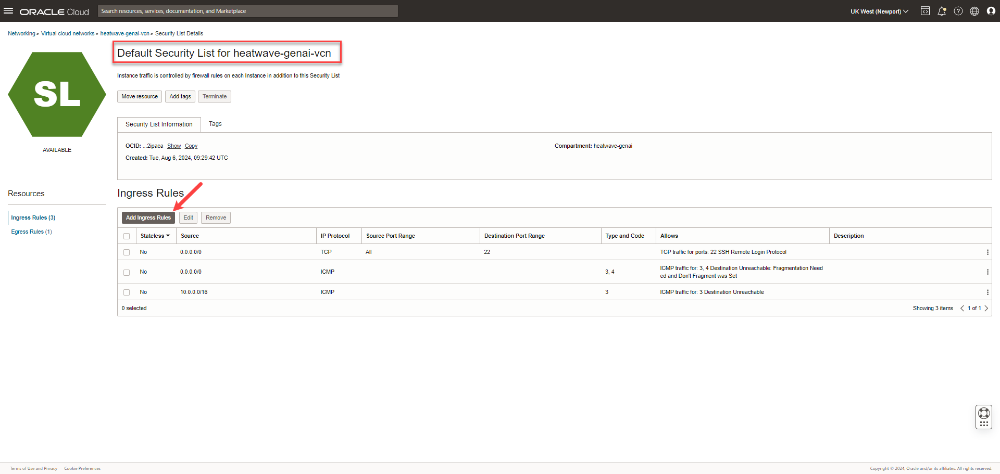
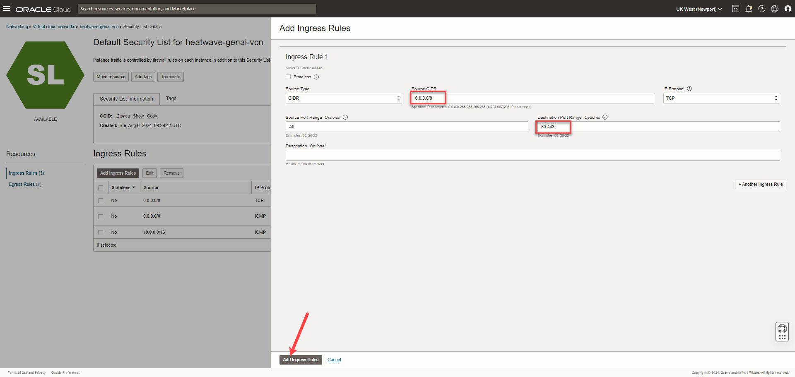
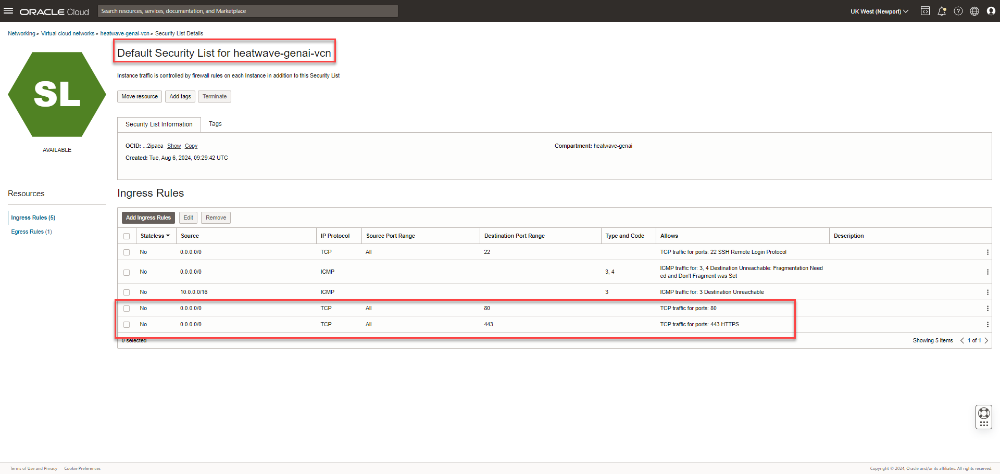

<!--
    {
        "name":"Allow incoming connections for the compute",
        "description":"Update the VCN security list to allow HTTP connections"
    }
-->

Update the security list for the public network to allow HTTP connections.

1. Click the **Navigation menu** in the upper left, navigate to **Networking**, and select **Virtual cloud networks**.

    

2. Under **Compartment**, ensure **[](var:hw_compartment_name)** is selected, and click the VCN you created, **[](var:hw_vcn_name)**.

    

3. On the **[](var:hw_vcn_name)** page, under **Subnets**, click  **public subnet-[](var:hw_vcn_name)**.

    

4. Click **Default Security List for [](var:hw_vcn_name)**.

    

5. On **Default Security List for [](var:hw_vcn_name)** page, under **Ingress Rules**, click **Add Ingress Rules**.

    

6. On **Add Ingress Rules** panel, enter the following, and click **Add Ingress Rules**:

    **Source CIDR**:

    ```
    <copy>0.0.0.0/0</copy>
    ```

    **Destination Port Range**:

    ```
    <copy>80,443</copy>
    ```

     

7. On **Default Security List for [](var:hw_vcn_name)** page, the new ingress rules are shown under **Ingress Rules**.

    