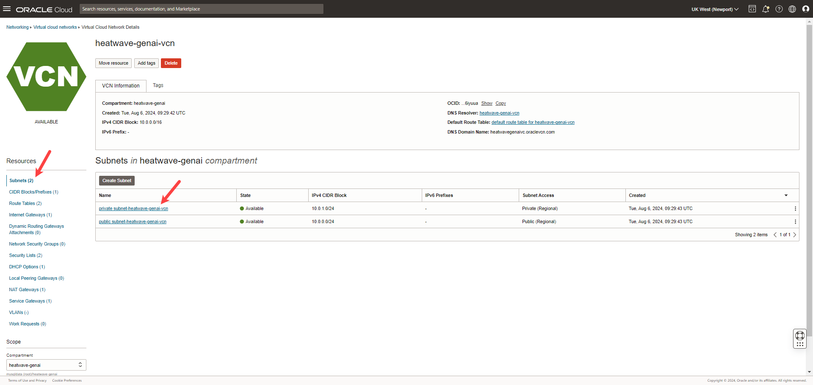
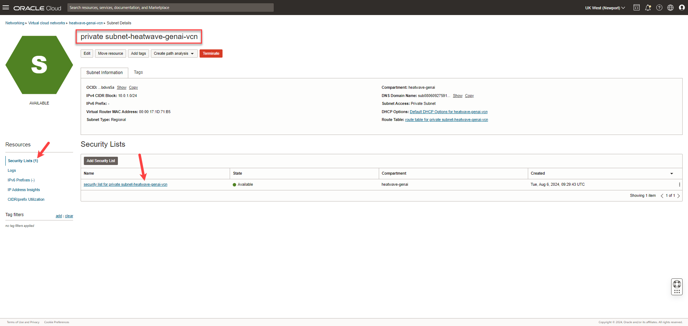
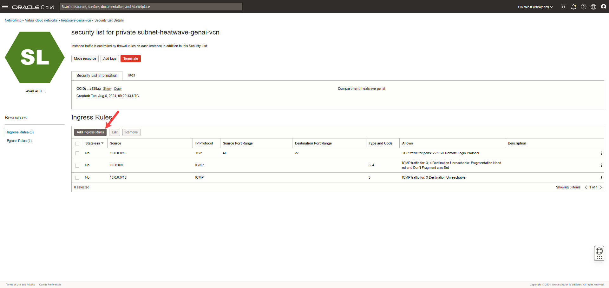
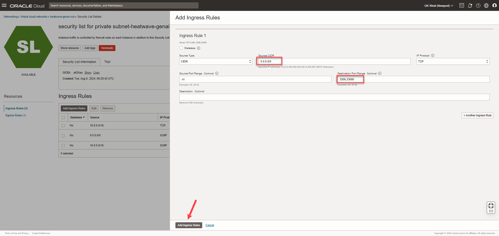
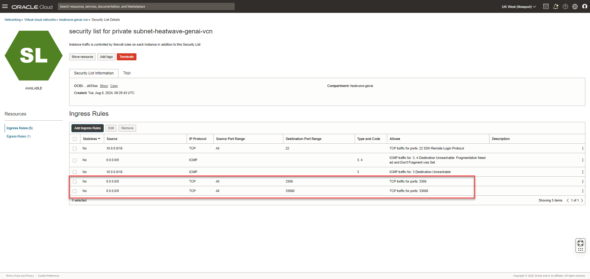

<!--
    {
        "name":"Allow incoming connections for the database",
        "description":"Update the VCN security list to allow connections to the database on specific ports"
    }
-->

We will update the security lists to add ingress rules for connecting to the database instance. 

1. On the **[](var:hw_vcn_name)** page, under **Subnets**, click  **private subnet-[](var:hw_vcn_name)**.

     

2. On **private subnet-[](var:hw_vcn_name)** page, under **Security Lists**, click  **security List for private subnet-[](var:hw_vcn_name)**.

    

3. On the **security list for private subnet-[](var:hw_vcn_name)** page, under **Ingress Rules**, click **Add Ingress Rules**.

    

4. On **Add Ingress Rules** panel, enter the following, and click **Add Ingress Rules**:

    **Source CIDR**:

    ```
    <copy>0.0.0.0/0</copy>
    ```

    **Destination Port Range**:

    ```
    <copy>3306,33060</copy>
    ```

    

5. On **security list for private subnet-[](var:hw_vcn_name)** page, the new ingress rules are shown under **Ingress Rules**.

    
