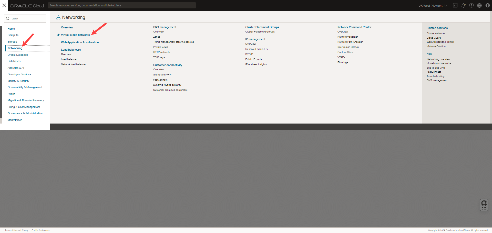
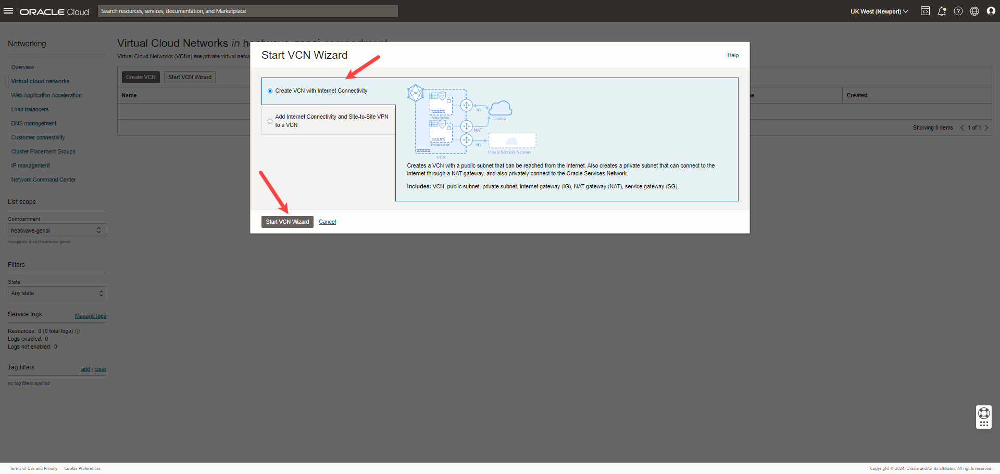
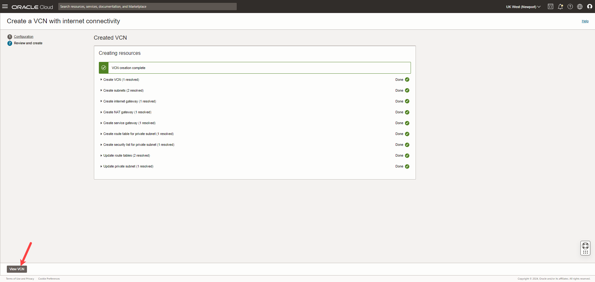

<!--
    {
        "name":"Create A virtual cloud network",
        "description":"Creates a virtual cloud network for the Heatwave and compute instance"
    }
-->
We will create a Virtual Cloud Network with a private and public subnet. In subsequent lab a Heatwave instance will be deployed in the private subnet and a compute, with MySQL client software, in the public subnet. 

1. Click the **Navigation menu** in the upper left, navigate to **Networking**, and select **Virtual cloud networks**.

    

2. Under **Compartment**, select **[](var:hw_compartment_name)**, and Click **Start VCN Wizard**.

    

3. In the **Start VCN Wizard** dialog box, select **Create VCN with Internet Connectivity**, and click **Start VCN Wizard**.

    

4. Under **Basic information**, provide a **VCN name**, e.g. [](var:hw_vcn_name):

    ```
    <copy>[](var:hw_vcn_name)</copy>
    ```

 5. Ensure that **[](var:hw_compartment_name)** compartment is selected, and click **Next**.

    

6. Review Oracle Virtual Cloud Network (VCN), Subnets, and Gateways, and click **Create**.

    

7. When the Virtual Cloud Network is created, click **View VCN** to display the created VCN.

    
